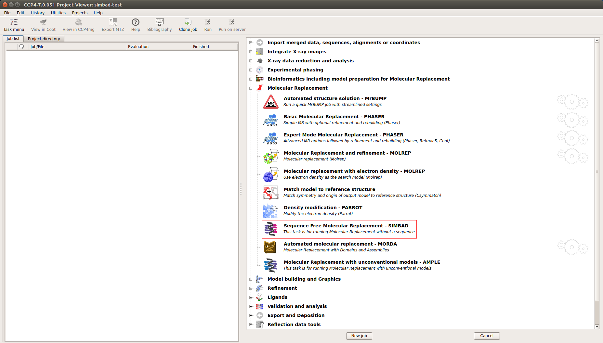
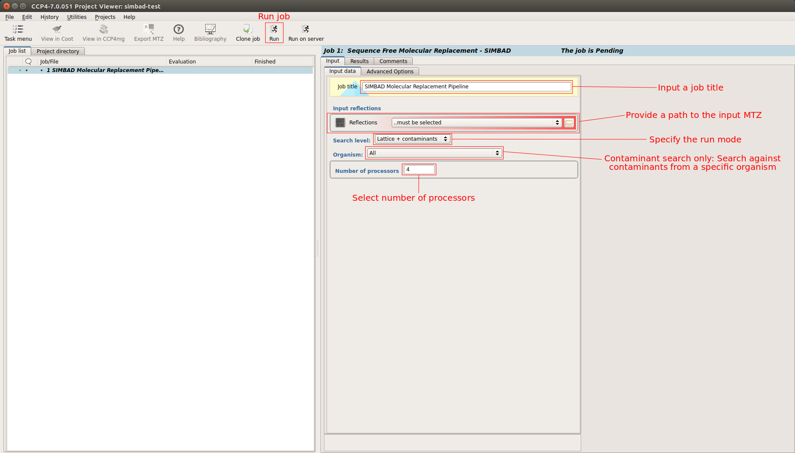
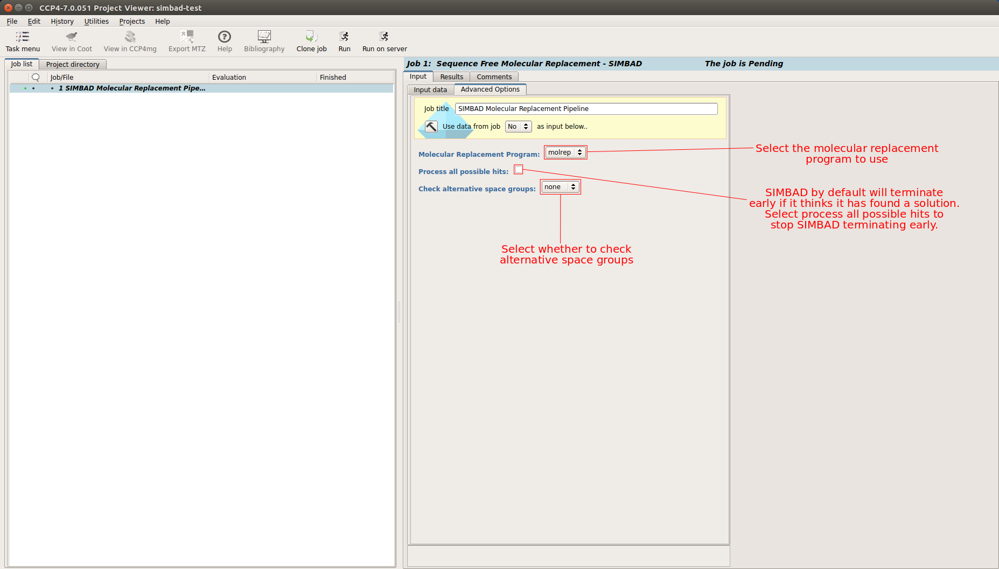
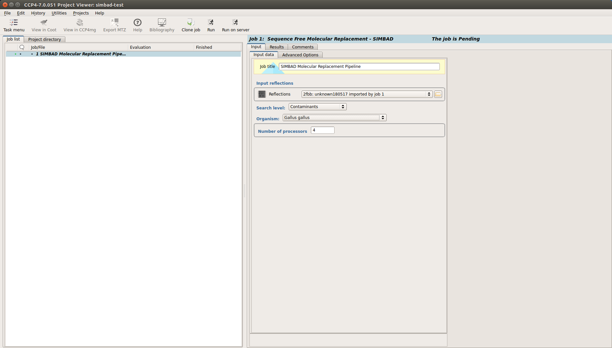
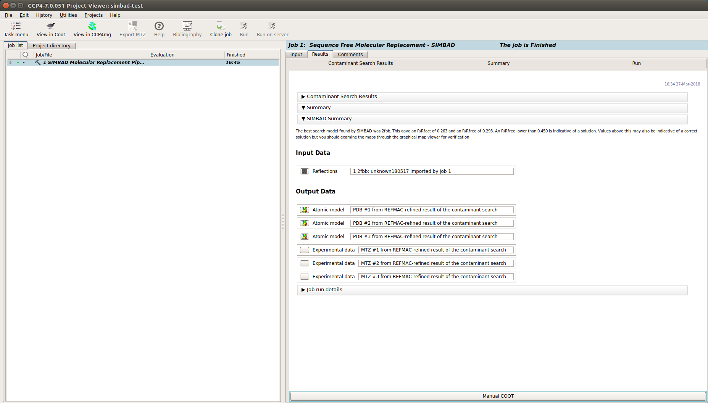
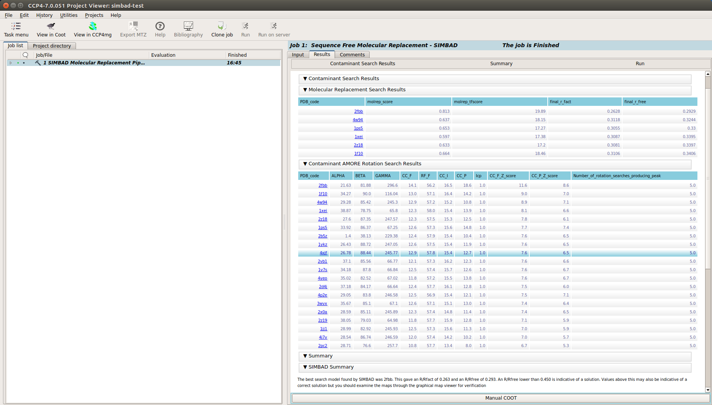

.. _ccp4i2_script_contaminant_search:

Searching for contaminants with SIMBAD
--------------------------------------

.. note::

   Data used throughout this example can be found in ``<ROOT>/examples/contaminant_example``. If SIMBAD is part of your CCP4 installation,
   then the example files can be downloaded as part of the `GitHub repository <https://github.com/rigdenlab/SIMBAD>`_.

0. Command line options
^^^^^^^^^^^^^^^^^^^^^^^
Check out this page explaining the :ref:`simbad-contaminant <simbad_contaminant_options>` script command line options.

1. Running the SIMBAD contaminant script
^^^^^^^^^^^^^^^^^^^^^^^^^^^^^^^^^^^^^^^^
In this example, the ``simbad-contaminant`` script simply takes the crystallographic data file in MTZ format, and runs the contaminant search on your local machine.

SIMBAD can be found under the Molecular Replacement menu in the CCP4i GUI:

Opening SIMBAD will bring you to the following menu:

Additionally the following advanced options can be selected:

To run the lattice search, all that is needed is an MTZ file:

SIMBAD Output
-------------
On starting SIMBAD a results page will appear summarising the progress of the SIMBAD lattice search and any results found.
The window will contain two sections, the contents of which are explained below:

.. contents:: Output Tabs
   :depth: 1
   :local:

Summary
^^^^^^^
The summary tab contains a summary of the best solution found by SIMBAD.

------------------------------------------------------------------

Contaminant Search Results
^^^^^^^^^^^^^^^^^^^^^^^^^^
The Contaminant Search Results are not shown by default. If selected however, 2 tables are displayed:

.. contents:: Tables
   :depth: 1
   :local:

------------------------------------------------------------------

Molecular Replacement Search Results
====================================
Molecular replacement is performed on the top 20 structures identified by the Lattice Parameter Search. This section displays the results of that molecular replacement.

By default SIMBAD runs Molecular replacement using MOLREP. If run the following columns are added to the table:

* **molrep_score:** MOLREP score for the Molecular Replacement solution
* **molrep_tfscore:** MOLREP translation function score for the Molecular Replacement solution

Alternatively SIMBAD can run Molecular replacement using PHASER. If run the following columns are added to the table:

* **phaser_llg:** PHASER Log-likelihood gain for the Molecular Replacement solution
* **phaser_tfz:** PHASER Translation Function Z-score for the Molecular Replacement solution
* **phaser_rfz:** PHASER Rotational Function Z-score for the Molecular Replacement solution

Following Molecular replacement, refinement is run using REFMAC. This add the following columns are added to the table:

* **final_r_fact:** R-fact score for REFMAC refinement of the Molecular Replacement solution
* **final_r_free:** R-free score for REFMAC refinement of the Molecular Replacement solution

.. note::

   Typically a result with a final_r_fact and a final_r_free below 0.45 is indicative of a solution.

Additionally if there is anomalous signal in your data set SIMBAD will try to validate the quality of the molecular replacement solution using by plotting the peaks from an anomalous fourier map. If run the following columns are added to the table:

* **dano_peak_height:** The highest anomalous peaks found
* **dano_z_score:** DANO peak Z-score

Contaminant database AMORE Rotation Search Results
==================================================

This shows the results from the AMORE Rotation Search carried out on the contaminant database. The columns of the table are:

* **PDB_code:** The 4 letter code representing the protein in the protein data bank
* **ALPHA:** Lattice parameter alpha
* **BETA:** Lattice parameter beta
* **GAMMA:** Lattice parameter gamma
* **CC_F:** he correlation coefficient between the observed amplitudes for the crystal and the calculated amplitudes for the model
* **RF_F:** The classic R factor between the observed amplitudes for the crystal and the calculated amplitudes for the model
* **CC_I:** The correlation coefficient between the observed intensities for the crystal and the sum of calculated intensities for all symmetry equivalents of the model
* **CC_P:** The Patterson correlation coefficient between the crystal and the model Pattersons evaluated within the defined sphere centered on the Patterson origin
* **Icp:**
* **CC_F_Z_score:** Z-score of CC_F peaks
* **CC_P_Z_score:** Z-score of CC_P peaks
* **Number_of_rotation_searches_producing_peak:** Number of rotations searches which produce each peak [out of 5]

The structures are scored by CC_F_Z_score score where a higher score is better.

At the bottom of the results page is a button labelled 'Manual coot', selecting this will allow you to view the best result SIMBAD has found.
