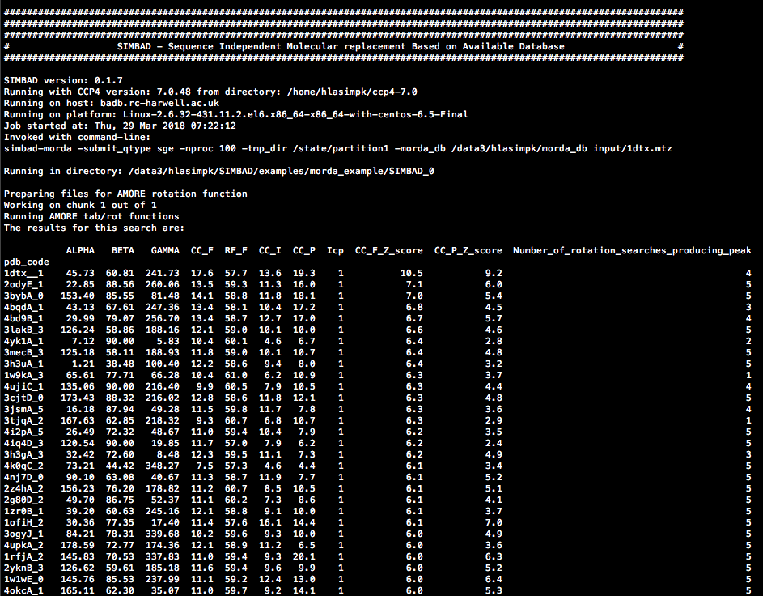
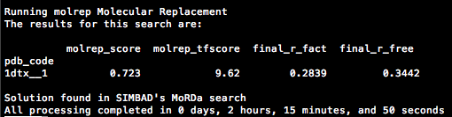

.. _script_morda_search:

Searching the MoRDa database with SIMBAD
----------------------------------------

.. note::

   Data used throughout this example can be found in ``<ROOT>/examples/morda_example``. If SIMBAD is part of your CCP4 installation,
   then the example files can be downloaded as part of the `GitHub repository <https://github.com/rigdenlab/SIMBAD>`_.

.. warning::

   You need to have a full copy of the `MoRDa database <http://www.biomexsolutions.co.uk/morda/>`_ installed locally. We also recommend that this search is not run on local machines, but clusters instead.

0. Command line options
^^^^^^^^^^^^^^^^^^^^^^^
Check out this page explaining the :ref:`simbad-morda <simbad_morda_options>` script command line options.

1. Running the script
^^^^^^^^^^^^^^^^^^^^^
In this example, the ``simbad-morda`` script simply takes the crystallographic data file in MTZ format and the path to the local copy of the MoRDa database. It then runs the rotation function search with all models in the database against your crystallographic data.

.. literalinclude:: /../examples/morda_example/run.sh
   :language: bash
   :lines: 12-18
   
SIMBAD Output
-------------
Upon running SIMBAD results will be output to the terminal

MoRDa database Search Results
^^^^^^^^^^^^^^^^^^^^^^^^^^^^^
The MoRDa database Search outputs 2 tables. Below you can find information about each:

.. contents:: Tables
   :depth: 1
   :local:

MoRDa database AMORE Rotation Search Results
============================================

This shows the results from the AMORE Rotation Search carried out on the MoRDa database. The columns of the table are:

* **PDB_code:** The 4 letter code representing the protein in the protein data bank
* **ALPHA:** Lattice parameter alpha
* **BETA:** Lattice parameter beta
* **GAMMA:** Lattice parameter gamma
* **CC_F:** he correlation coefficient between the observed amplitudes for the crystal and the calculated amplitudes for the model
* **RF_F:** The classic R factor between the observed amplitudes for the crystal and the calculated amplitudes for the model
* **CC_I:** The correlation coefficient between the observed intensities for the crystal and the sum of calculated intensities for all symmetry equivalents of the model
* **CC_P:** The Patterson correlation coefficient between the crystal and the model Pattersons evaluated within the defined sphere centred on the Patterson origin
* **Icp:** 
* **CC_F_Z_score:** Z-score of CC_F peaks
* **CC_P_Z_score:** Z-score of CC_P peaks
* **Number_of_rotation_searches_producing_peak:** Number of rotations searches which produce each peak [out of 5]

The structures are scored by CC_F_Z_score score where a higher score is better.

Molecular Replacement Search Results
====================================

Molecular replacement is performed on the top 200 structures identified by the MoRDa database AMORE Rotation search. This section displays the results of that molecular replacement.

By default SIMBAD runs Molecular replacement using MOLREP. If run the following columns are added to the table:

* **molrep_score:** MOLREP score for the Molecular Replacement solution
* **molrep_tfscore:** MOLREP translation function score for the Molecular Replacement solution

Alternatively SIMBAD can run Molecular replacement using PHASER. If run the following columns are added to the table:

* **phaser_llg:** PHASER Log-likelihood gain for the Molecular Replacement solution
* **phaser_tfz:** PHASER Translation Function Z-score for the Molecular Replacement solution
* **phaser_rfz:** PHASER Rotational Function Z-score for the Molecular Replacement solution

Following Molecular replacement, refinement is run using REFMAC. This add the following columns are added to the table:

* **final_r_fact:** R-fact score for REFMAC refinement of the Molecular Replacement solution
* **final_r_free:** R-free score for REFMAC refinement of the Molecular Replacement solution

.. note::

   Typically a result with a final_r_fact and a final_r_free below 0.45 is indicative of a solution.

Additionally if there is anomalous signal in your dataset SIMBAD will try to validate the quality of the molecular replacement solution using by plotting the peaks from a phased anomalous fourier map. If run the following columns are added to the table:

* **dano_peak_height:** The highest anomalous peaks found
* **dano_z_score:** DANO peak Z-score

